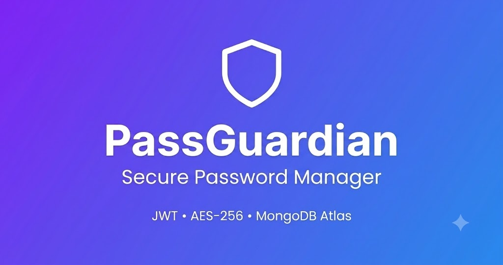
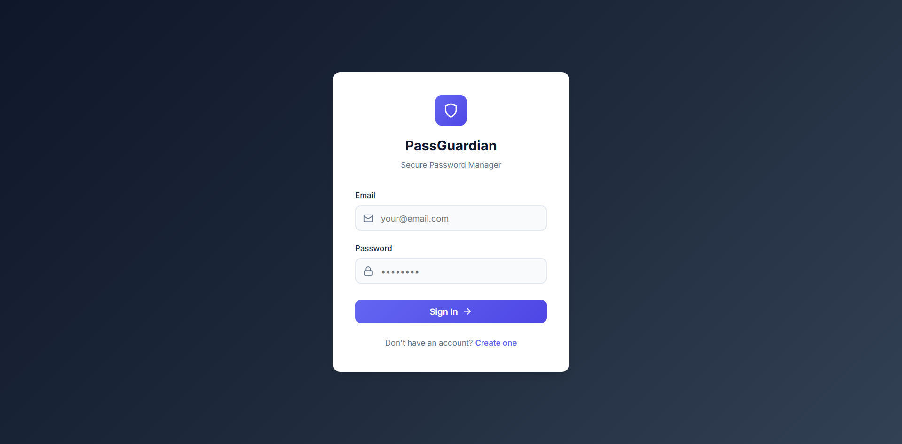
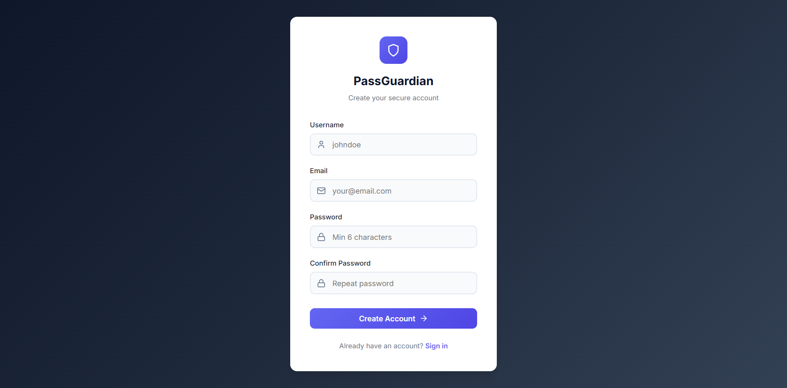
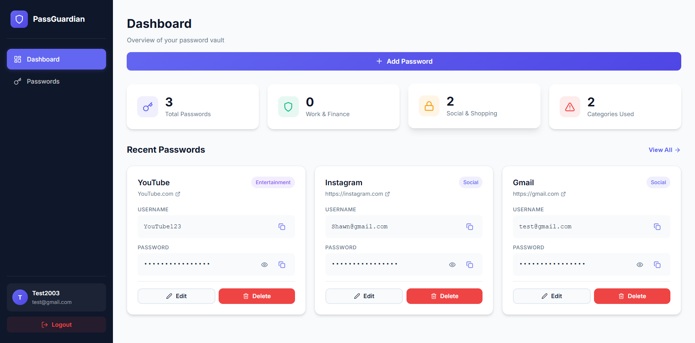
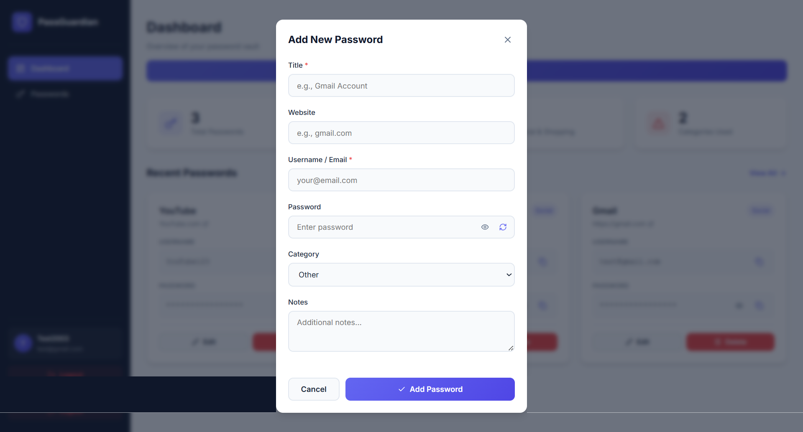

# 🔐 PassGuardian

<div align="center">



### Secure Password Manager Built with React, Node.js, Express & MongoDB

Store, manage, generate, and organize your passwords securely with encrypted credential storage, JWT authentication, and a modern responsive dashboard.

**Live Demo:** https://passguardian.vercel.app

**Backend API:** https://passguardian-api.onrender.com

</div>

---

## 📌 Overview

PassGuardian is a full-stack password management application designed to securely store and manage user credentials. The application provides user authentication, encrypted password storage, password generation, category-based organization, and a clean dashboard interface.

This project demonstrates modern full-stack web development practices including authentication, authorization, database management, API development, encryption, and cloud deployment.

---

# ✨ Features

### 🔐 Authentication & Security

- User Registration
- User Login
- JWT Authentication
- Protected Routes
- Password Hashing using bcrypt
- Secure Token Verification
- Encrypted Password Storage
- Environment Variable Protection

### 🔑 Password Management

- Add New Passwords
- Edit Existing Passwords
- Delete Passwords
- Show / Hide Password
- Copy Username
- Copy Password
- Password Generator
- Password Strength Indicator
- Category Management

### 📊 Dashboard

- Total Password Statistics
- Category Statistics
- Recent Passwords Overview
- Responsive Dashboard Layout
- User Profile Section

### 🎨 User Experience

- Modern UI Design
- Fully Responsive Layout
- Toast Notifications
- Loading States
- Smooth User Flow

---

# 🛠️ Tech Stack

## Frontend

- React.js
- React Router DOM
- Axios
- React Icons
- React Toastify
- CSS3

## Backend

- Node.js
- Express.js
- JWT Authentication
- bcryptjs
- Crypto (AES Encryption)

## Database

- MongoDB Atlas
- Mongoose

## Deployment

- Vercel (Frontend)
- Render (Backend)
- MongoDB Atlas (Database)

---

# 📂 Project Structure

```bash
PassGuardian/
│
├── backend/
│   ├── middleware/
│   ├── models/
│   ├── routes/
│   ├── utils/
│   ├── server.js
│   └── package.json
│
├── frontend/
│   ├── public/
│   ├── src/
│   │   ├── components/
│   │   ├── context/
│   │   ├── pages/
│   │   ├── services/
│   │   └── App.js
│   │
│   ├── package.json
│   └── vercel.json
│
└── README.md
```

---

# 🔒 Security Implementation

## Password Hashing

User account passwords are hashed using:

```javascript
bcryptjs;
```

before storing in MongoDB.

---

## JWT Authentication

Protected API routes use:

```javascript
jsonwebtoken;
```

for authentication and authorization.

---

## Password Encryption

Stored credentials are encrypted before being saved to the database.

Sensitive password data is never stored in plain text.

---

## Environment Variables

Secrets are stored securely using:

```env
MONGODB_URI=
JWT_SECRET=
ENCRYPTION_KEY=
FRONTEND_URL=
```

and are never committed to GitHub.

---

# 📸 Application Screenshots

## Login Page

Add screenshot:

```text
screenshots/login.png
```

```md

```

---

## Register Page

```md

```

---

## Dashboard

```md

```

---

## Add Password

```md

```

---

## Edit Password

```md

```

---

# ⚙️ Installation Guide

## Clone Repository

```bash
git clone https://github.com/muqtadirkhxn/PassGuardian.git
```

```bash
cd PassGuardian
```

---

# Backend Setup

```bash
cd backend
npm install
```

Create:

```env
.env
```

```env
PORT=5000
NODE_ENV=development

MONGODB_URI=your_mongodb_connection_string

JWT_SECRET=your_jwt_secret

JWT_EXPIRE=7d

ENCRYPTION_KEY=your_encryption_key

FRONTEND_URL=http://localhost:3000
```

Run Backend:

```bash
npm run dev
```

---

# Frontend Setup

```bash
cd frontend
npm install
```

Create:

```env
.env
```

```env
REACT_APP_API_URL=http://localhost:5000/api
```

Run Frontend:

```bash
npm start
```

---

# 🌐 Deployment

## Frontend

Deployed on:

**Vercel**

```text
https://passguardian.vercel.app
```

---

## Backend

Deployed on:

**Render**

```text
https://passguardian-api.onrender.com
```

---

## Database

Hosted on:

**MongoDB Atlas**

---

# 🧪 Testing Checklist

### Authentication

- [x] Register User
- [x] Login User
- [x] Logout User
- [x] Protected Routes

### Password Management

- [x] Create Password
- [x] Update Password
- [x] Delete Password
- [x] View Password
- [x] Copy Password

### Deployment

- [x] Frontend Deployment
- [x] Backend Deployment
- [x] Database Connection
- [x] Production Environment Variables

---

# 🚀 Future Improvements

- Dark Mode
- Search Passwords
- Advanced Filtering
- Password Export
- Password Import
- Two-Factor Authentication (2FA)
- Password Breach Detection
- Password Sharing
- Activity Logs

---

# 👨‍💻 Author

### Muqtadir Khan

Master of Computer Applications (MCA)

GitHub:
https://github.com/muqtadirkhxn

LinkedIn:
(Add your LinkedIn URL)

Portfolio:
(Add your Portfolio URL)

---

# 📄 License

This project is created for educational, learning, and portfolio purposes.

© 2026 Muqtadir Khan. All Rights Reserved.
